# CppLProlog Architecture

This document describes the internal architecture and design decisions of the CppLProlog interpreter.

## Table of Contents

- [Overview](#overview)
- [System Architecture](#system-architecture)
- [Component Details](#component-details)
  - [Term System](#term-system-srcprologtermhcpp)
  - [Unification Engine](#unification-engine-srcprologunificationhcpp)
  - [Parser](#parser-srcprologparserhcpp)
  - [Database](#database-srcprologdatabasehcpp)
  - [Resolution Engine](#resolution-engine-srcprologresolverhcpp)
  - [Built-in Predicates](#built-in-predicates-srcprologbuiltin_predicateshcpp)
  - [Interpreter](#interpreter-srcprologinterpreterhcpp)
- [Memory Management](#memory-management)
- [Error Handling](#error-handling)
- [Thread Safety](#thread-safety)
- [Extension Points](#extension-points)
- [Testing Architecture](#testing-architecture)
- [Benchmarking](#benchmarking)
- [Future Enhancements](#future-enhancements)

For visual data flow diagrams, see [Data Flow Documentation](DATA_FLOW.md).

## Overview

CppLProlog is designed as a modular, high-performance Prolog interpreter using modern C++23 features. The architecture follows clean separation of concerns with well-defined interfaces between components.

## System Architecture

```mermaid
graph TB
    subgraph "User Interface Layer"
        UI["🎯 Interactive REPL<br/>• Command Processing<br/>• File Loading<br/>• Query Execution"]
    end
    
    subgraph "Interpretation Layer"
        INT["🧠 Interpreter<br/>• Query Coordination<br/>• Solution Management<br/>• Error Handling<br/>• Statistics"]
    end
    
    subgraph "Core Logic Layer"
        RES["🔄 Resolver<br/>• SLD Resolution<br/>• Backtracking Engine<br/>• Choice Point Stack<br/>• Goal Management"]
        
        UNI["🔗 Unification Engine<br/>• Robinson's Algorithm<br/>• Occurs Check<br/>• Substitution Composition<br/>• Variable Dereferencing"]
        
        BIP["⚡ Built-in Predicates<br/>• List Operations<br/>• Type Checking<br/>• Comparison Operators<br/>• Control Flow"]
    end
    
    subgraph "Data Management Layer"
        DB["🗄️ Database<br/>• Clause Storage<br/>• Functor/Arity Indexing<br/>• Efficient Retrieval<br/>• Memory Optimization"]
        
        TERMS["🏗️ Term System<br/>• Polymorphic Hierarchy<br/>• Smart Pointer Management<br/>• Immutable Design<br/>• Hash-based Operations"]
    end
    
    subgraph "Parsing Layer"
        LEX["📝 Lexer<br/>• Tokenization<br/>• Comment Handling<br/>• Position Tracking<br/>• Error Recovery"]
        
        PAR["🌳 Parser<br/>• Recursive Descent<br/>• AST Construction<br/>• Operator Precedence<br/>• Syntax Validation"]
    end
    
    subgraph "Infrastructure Layer"
        MEM["💾 Memory Management<br/>• Reference Counting<br/>• RAII Principles<br/>• Memory Pools<br/>• Automatic Cleanup"]
        
        ERR["⚠️ Error Handling<br/>• Exception Hierarchy<br/>• Context Preservation<br/>• Graceful Recovery<br/>• User-friendly Messages"]
    end
    
    UI --> INT
    INT --> RES
    INT --> DB
    INT --> PAR
    
    RES --> UNI
    RES --> BIP
    RES --> DB
    
    PAR --> LEX
    PAR --> TERMS
    
    UNI --> TERMS
    BIP --> TERMS
    DB --> TERMS
    
    TERMS --> MEM
    INT --> ERR
    PAR --> ERR
    
    classDef userLayer fill:#e3f2fd,stroke:#1976d2,stroke-width:2px
    classDef interpretLayer fill:#e8f5e8,stroke:#388e3c,stroke-width:2px
    classDef coreLayer fill:#fff3e0,stroke:#f57c00,stroke-width:2px
    classDef dataLayer fill:#fce4ec,stroke:#c2185b,stroke-width:2px
    classDef parseLayer fill:#f3e5f5,stroke:#7b1fa2,stroke-width:2px
    classDef infraLayer fill:#e0f2f1,stroke:#00695c,stroke-width:2px
    
    class UI userLayer
    class INT interpretLayer
    class RES,UNI,BIP coreLayer
    class DB,TERMS dataLayer
    class LEX,PAR parseLayer
    class MEM,ERR infraLayer
```



## Component Details

### Term System (`src/prolog/term.h/cpp`)

The term system forms the foundation of the interpreter, representing all Prolog data structures.

#### Term Hierarchy


#### Key Design Decisions

1. **Shared Pointer Management**: Terms use `std::shared_ptr` for automatic memory management
2. **Type Safety**: Runtime type checking with `is<T>()` and `as<T>()` methods
3. **Immutability**: Terms are immutable after creation (clone for modifications)
4. **Hash Support**: All terms implement consistent hashing for indexing

#### Memory Management

```cpp
using TermPtr = std::shared_ptr<Term>;
using TermList = std::vector<TermPtr>;

// Factory functions ensure consistent creation
TermPtr makeAtom(const std::string& name);
TermPtr makeCompound(const std::string& functor, TermList arguments);
```

### Unification Engine (`src/prolog/unification.h/cpp`)

Implements Robinson's unification algorithm with occurs check.

#### Unification Algorithm

```mermaid
flowchart TD
    Start(["unify(T1, T2)"]) --> Deref["🔍 Dereference T1, T2<br/>Follow variable bindings"]
    Deref --> EqualCheck{"T1 equals T2?<br/>(structural equality)"}
    
    EqualCheck -->|"✅ Yes"| SuccessEmpty["✅ Success<br/>Return current substitution"]
    EqualCheck -->|"❌ No"| VarCheck1{"T1 is Variable?"}
    
    VarCheck1 -->|"✅ Yes"| VarCheck2{"T2 is Variable?"}
    VarCheck2 -->|"✅ Yes"| VarVarBind["🔗 Bind T1 → T2<br/>Update substitution"]
    VarVarBind --> SuccessVarVar["✅ Success<br/>Variable-Variable binding"]
    
    VarCheck2 -->|"❌ No"| OccursCheck1["🔍 Occurs Check<br/>Does T1 occur in T2?"]
    OccursCheck1 -->|"⚠️ Yes"| FailOccurs1["❌ Failure<br/>Infinite structure detected"]
    OccursCheck1 -->|"✅ No"| VarTermBind["🔗 Bind T1 → T2<br/>Update substitution"]
    VarTermBind --> SuccessVarTerm["✅ Success<br/>Variable-Term binding"]
    
    VarCheck1 -->|"❌ No"| VarCheck3{"T2 is Variable?"}
    VarCheck3 -->|"✅ Yes"| OccursCheck2["🔍 Occurs Check<br/>Does T2 occur in T1?"]
    OccursCheck2 -->|"⚠️ Yes"| FailOccurs2["❌ Failure<br/>Infinite structure detected"]
    OccursCheck2 -->|"✅ No"| TermVarBind["🔗 Bind T2 → T1<br/>Update substitution"]
    TermVarBind --> SuccessTermVar["✅ Success<br/>Term-Variable binding"]
    
    VarCheck3 -->|"❌ No"| TypeCheck{"Same TermType?<br/>(ATOM, COMPOUND, etc.)"}
    TypeCheck -->|"❌ No"| FailType["❌ Failure<br/>Type mismatch"]
    
    TypeCheck -->|"✅ Yes"| StructCheck{"Term structure?"}
    StructCheck -->|"Atomic"| AtomCheck{"Same atom name?"}
    AtomCheck -->|"✅ Yes"| SuccessAtomic["✅ Success<br/>Identical atoms"]
    AtomCheck -->|"❌ No"| FailAtomic["❌ Failure<br/>Different atoms"]
    
    StructCheck -->|"Compound"| CompoundCheck{"Same functor/arity?"}
    CompoundCheck -->|"❌ No"| FailCompound["❌ Failure<br/>Different functors"]
    CompoundCheck -->|"✅ Yes"| RecursiveUnify["🔄 Recursive Unification<br/>Unify all arguments"]
    
    RecursiveUnify --> RecursiveCheck{"All arguments<br/>unified successfully?"}
    RecursiveCheck -->|"❌ No"| FailRecursive["❌ Failure<br/>Argument unification failed"]
    RecursiveCheck -->|"✅ Yes"| SuccessRecursive["✅ Success<br/>Compound unification complete"]
    
    StructCheck -->|"List"| ListUnify["📝 List Unification<br/>Handle elements and tail"]
    ListUnify --> ListCheck{"List structures<br/>compatible?"}
    ListCheck -->|"✅ Yes"| SuccessList["✅ Success<br/>List unification complete"]
    ListCheck -->|"❌ No"| FailList["❌ Failure<br/>Incompatible lists"]
    
    classDef success fill:#c8e6c9,stroke:#388e3c,stroke-width:2px
    classDef failure fill:#ffcdd2,stroke:#d32f2f,stroke-width:2px
    classDef process fill:#e3f2fd,stroke:#1976d2,stroke-width:2px
    classDef decision fill:#fff3e0,stroke:#f57c00,stroke-width:2px
    
    class SuccessEmpty,SuccessVarVar,SuccessVarTerm,SuccessTermVar,SuccessAtomic,SuccessRecursive,SuccessList success
    class FailOccurs1,FailOccurs2,FailType,FailAtomic,FailCompound,FailRecursive,FailList failure
    class Deref,OccursCheck1,OccursCheck2,VarVarBind,VarTermBind,TermVarBind,RecursiveUnify,ListUnify process
    class EqualCheck,VarCheck1,VarCheck2,VarCheck3,TypeCheck,StructCheck,AtomCheck,CompoundCheck,RecursiveCheck,ListCheck decision
```



#### Substitution Management

```cpp
using Substitution = std::unordered_map<std::string, TermPtr>;

class Unification {
public:
    static std::optional<Substitution> unify(const TermPtr& t1, const TermPtr& t2);
    static TermPtr applySubstitution(const TermPtr& term, const Substitution& subst);
    static Substitution compose(const Substitution& s1, const Substitution& s2);
};
```

### Parser (`src/prolog/parser.h/cpp`)

Two-phase parsing: lexical analysis followed by syntax analysis.

#### Lexer

- **Token Types**: Atoms, variables, numbers, strings, operators, punctuation
- **Comment Handling**: Skip % comments
- **String Escaping**: Support for escape sequences
- **Error Recovery**: Position tracking for error reporting

#### Parser

- **Recursive Descent**: Clean, maintainable parsing strategy
- **Operator Precedence**: Proper handling of Prolog operators
- **Error Reporting**: Detailed syntax error messages

#### Grammar Support

```prolog
Clause    := Term '.' | Term ':-' TermList '.'
Term      := Atom | Variable | Number | String | Compound | List
Compound  := Atom '(' TermList ')'
List      := '[' TermList ']' | '[' TermList '|' Term ']'
TermList  := Term (',' Term)*
```

### Database (`src/prolog/database.h/cpp`)

Efficient storage and retrieval of Prolog clauses.

#### Indexing Strategy

- **Functor/Arity Index**: Primary index on predicate functor and arity
- **First Argument Index**: Secondary index for goal-directed search (future)
- **Hash-based Lookup**: O(1) average case retrieval

#### Storage Model

```cpp
class Database {
private:
    std::vector<ClausePtr> clauses_;                    // Sequential storage
    std::unordered_map<std::string, std::vector<size_t>> index_;  // Functor/arity index
    
public:
    std::vector<ClausePtr> findMatchingClauses(const TermPtr& goal);
};
```

### Resolution Engine (`src/prolog/resolver.h/cpp`)

Implements SLD resolution with chronological backtracking.

#### Resolution Strategy

1. **Goal Selection**: Left-to-right goal ordering
2. **Clause Selection**: Database order with backtracking
3. **Unification**: Attempt unification with each matching clause
4. **Substitution**: Apply substitutions to remaining goals
5. **Recursion**: Resolve new goal set

#### Choice Point Management

```cpp
class Choice {
    TermPtr goal;                    // Current goal
    TermList remaining_goals;        // Goals to resolve after current
    std::vector<ClausePtr> clauses;  // Available clauses for current goal
    size_t clause_index;             // Next clause to try
    Substitution bindings;           // Current variable bindings
};
```

#### SLD Resolution Algorithm

```mermaid
flowchart TD
    Start(["🎯 solve(Goals, Substitution)"]) --> EmptyCheck{"📋 Goals list empty?"}
    
    EmptyCheck -->|"✅ Yes"| Success["🎉 SUCCESS<br/>Return current solution<br/>with variable bindings"]
    
    EmptyCheck -->|"❌ No"| SelectGoal["🎯 Select First Goal<br/>Apply current substitution"]
    
    SelectGoal --> FindClauses["🔍 Database Lookup<br/>Find clauses matching goal<br/>functor/arity"]
    
    FindClauses --> ClausesCheck{"📚 Matching clauses<br/>available?"}
    
    ClausesCheck -->|"❌ No"| Backtrack["⬅️ BACKTRACK<br/>Pop choice point<br/>Try alternative"]
    
    ClausesCheck -->|"✅ Yes"| CreateChoice["💾 Create Choice Point<br/>Save: goal, remaining goals,<br/>clauses, bindings"]
    
    CreateChoice --> SelectClause["📄 Select Next Clause<br/>Try clauses in order"]
    
    SelectClause --> RenameVars["🏷️ Rename Variables<br/>Avoid variable name conflicts<br/>with unique suffix"]
    
    RenameVars --> AttemptUnify["🔗 Attempt Unification<br/>goal ← clause_head"]
    
    AttemptUnify --> UnifyCheck{"🔗 Unification<br/>successful?"}
    
    UnifyCheck -->|"❌ No"| MoreClauses{"📚 More clauses<br/>to try?"}
    MoreClauses -->|"✅ Yes"| SelectClause
    MoreClauses -->|"❌ No"| Backtrack
    
    UnifyCheck -->|"✅ Yes"| ApplySubst["⚡ Apply Substitution<br/>Update variable bindings<br/>throughout goal set"]
    
    ApplySubst --> AddBodyGoals["📝 Add Body Goals<br/>Replace current goal with<br/>clause body goals"]
    
    AddBodyGoals --> PushChoice["📚 Push Choice Point<br/>Save state for potential<br/>backtracking"]
    
    PushChoice --> RecursiveCall["🔄 Recursive Resolution<br/>solve(new_goals, new_subst)"]
    
    RecursiveCall --> SolutionCheck{"🎯 Solution found?"}
    
    SolutionCheck -->|"✅ Yes"| ReportSolution["📊 Report Solution<br/>Filter query variables<br/>Format for output"]
    
    SolutionCheck -->|"❌ No"| BacktrackDecision{"⚙️ Should backtrack<br/>for more solutions?"}
    
    BacktrackDecision -->|"✅ Yes"| PopChoice["📤 Pop Choice Point<br/>Restore previous state<br/>Continue with next clause"]
    PopChoice --> MoreClauses
    
    BacktrackDecision -->|"❌ No"| Backtrack
    
    ReportSolution --> ContinueSearch{"🔍 Continue search<br/>for more solutions?"}
    ContinueSearch -->|"✅ Yes"| BacktrackDecision
    ContinueSearch -->|"❌ No"| Complete["🏁 COMPLETE<br/>Resolution finished"]
    
    Backtrack --> BacktrackCheck{"📚 Choice points<br/>available?"}
    BacktrackCheck -->|"✅ Yes"| PopChoice
    BacktrackCheck -->|"❌ No"| Failure["❌ FAILURE<br/>No more alternatives<br/>Query has no solutions"]
    
    subgraph "Choice Point Stack"
        CP["Choice Point {<br/>  goal: current_goal<br/>  remaining: [goal2, goal3, ...]<br/>  clauses: [clause1, clause2, ...]<br/>  index: current_clause_position<br/>  bindings: {X→a, Y→b, ...}<br/>}"]
    end
    
    classDef success fill:#c8e6c9,stroke:#388e3c,stroke-width:3px
    classDef failure fill:#ffcdd2,stroke:#d32f2f,stroke-width:2px
    classDef process fill:#e3f2fd,stroke:#1976d2,stroke-width:2px
    classDef decision fill:#fff3e0,stroke:#f57c00,stroke-width:2px
    classDef backtrack fill:#f3e5f5,stroke:#7b1fa2,stroke-width:2px
    classDef complete fill:#e0f2f1,stroke:#00695c,stroke-width:2px
    
    class Success,ReportSolution success
    class Failure failure
    class SelectGoal,FindClauses,CreateChoice,SelectClause,RenameVars,AttemptUnify,ApplySubst,AddBodyGoals,PushChoice,RecursiveCall process
    class EmptyCheck,ClausesCheck,UnifyCheck,MoreClauses,SolutionCheck,BacktrackDecision,ContinueSearch,BacktrackCheck decision
    class Backtrack,PopChoice backtrack
    class Complete complete
```



### Built-in Predicates (`src/prolog/builtin_predicates.h/cpp`)

Extensible system for built-in predicates.

#### Registration System

```cpp
using BuiltinHandler = std::function<bool(const TermList&, Substitution&, 
                                         std::function<bool(const Solution&)>)>;

static std::unordered_map<std::string, BuiltinHandler> builtins_;

// Register new built-in
builtins_["functor/arity"] = handler_function;
```

#### Arithmetic Integration

- **Expression Evaluation**: `is/2` predicate evaluates arithmetic expressions
- **Comparison Operators**: `</2`, `>/2`, `=</2`, `>=/2`, `=:=/2`, `=\\=/2`
- **Type Coercion**: Automatic integer/float conversion

### Interpreter (`src/prolog/interpreter.h/cpp`)

High-level interface combining all components.

#### Query Processing Pipeline

```mermaid
flowchart TD
    subgraph "Input Processing Layer"
        UI(["👥 User Input<br/>Query string or file"])
        CMD_CHECK{"⚙️ Command Check<br/>:quit, :help, :load?"}
        CMD_HANDLER["📦 Command Handler<br/>Process special commands"]
    end
    
    subgraph "Lexical Analysis Layer"
        LEX["📝 Lexer<br/>• Tokenization<br/>• Comment removal<br/>• Position tracking"]
        TOKENS["🏷️ Token Stream<br/>ATOM, VARIABLE, OPERATOR.."]
    end
    
    subgraph "Syntactic Analysis Layer"
        PARSE["🌳 Parser<br/>• Recursive descent<br/>• Operator precedence<br/>• Error recovery"]
        AST["🏗️ Query AST<br/>TermPtr structure"]
    end
    
    subgraph "Resolution Preparation"
        VAR_EXTRACT["🔍 Extract Variables<br/>Identify query variables<br/>for solution filtering"]
        DB_LOOKUP["🗄️ Database Lookup<br/>Find matching clauses<br/>by functor/arity"]
    end
    
    subgraph "Resolution Engine"
        RESOLVER["🔄 SLD Resolver<br/>• Goal processing<br/>• Choice point management<br/>• Backtracking control"]
        
        UNIFY["🔗 Unification<br/>• Robinson's algorithm<br/>• Occurs check<br/>• Substitution building"]
        
        BUILTIN_CHECK{"⚡ Built-in Predicate?<br/>Special handling needed?"}
        BUILTIN_EXEC["⚡ Execute Built-in<br/>List ops, type checks, etc."]
    end
    
    subgraph "Solution Management"
        SOL_FILTER["🎯 Solution Filtering<br/>Keep only query variables<br/>Remove internal variables"]
        SOL_FORMAT["🎨 Solution Formatting<br/>Convert to readable format<br/>Handle multiple bindings"]
    end
    
    subgraph "Output Layer"
        DISPLAY["📺 Display Results<br/>• Colored output<br/>• Pagination support<br/>• Error messages"]
        CONTINUE{"➡️ Continue Search?<br/>User requests more solutions?"}
    end
    
    subgraph "Error Handling"
        ERR_CATCH["⚠️ Exception Handling<br/>• Parse errors<br/>• Runtime errors<br/>• User-friendly messages"]
    end
    
    UI --> CMD_CHECK
    CMD_CHECK -->|"⚙️ Command"| CMD_HANDLER
    CMD_CHECK -->|"📝 Query"| LEX
    
    LEX --> TOKENS
    TOKENS --> PARSE
    PARSE --> AST
    
    AST --> VAR_EXTRACT
    VAR_EXTRACT --> DB_LOOKUP
    DB_LOOKUP --> RESOLVER
    
    RESOLVER --> BUILTIN_CHECK
    BUILTIN_CHECK -->|"✅ Yes"| BUILTIN_EXEC
    BUILTIN_CHECK -->|"❌ No"| UNIFY
    
    BUILTIN_EXEC --> SOL_FILTER
    UNIFY --> RESOLVER
    RESOLVER --> SOL_FILTER
    
    SOL_FILTER --> SOL_FORMAT
    SOL_FORMAT --> DISPLAY
    DISPLAY --> CONTINUE
    
    CONTINUE -->|"✅ More"| RESOLVER
    CONTINUE -->|"❌ Done"| UI
    
    LEX -.-> ERR_CATCH
    PARSE -.-> ERR_CATCH
    RESOLVER -.-> ERR_CATCH
    ERR_CATCH --> DISPLAY
    
    CMD_HANDLER --> UI
    
    classDef input fill:#e3f2fd,stroke:#1976d2,stroke-width:2px
    classDef lexical fill:#e8f5e8,stroke:#388e3c,stroke-width:2px
    classDef syntax fill:#fff3e0,stroke:#f57c00,stroke-width:2px
    classDef resolution fill:#fce4ec,stroke:#c2185b,stroke-width:2px
    classDef solution fill:#f3e5f5,stroke:#7b1fa2,stroke-width:2px
    classDef output fill:#e0f2f1,stroke:#00695c,stroke-width:2px
    classDef error fill:#ffcdd2,stroke:#d32f2f,stroke-width:2px
    
    class UI,CMD_CHECK,CMD_HANDLER input
    class LEX,TOKENS lexical
    class PARSE,AST syntax
    class VAR_EXTRACT,DB_LOOKUP,RESOLVER,UNIFY,BUILTIN_CHECK,BUILTIN_EXEC resolution
    class SOL_FILTER,SOL_FORMAT solution
    class DISPLAY,CONTINUE output
    class ERR_CATCH error
```



#### Interactive Mode

- **REPL Loop**: Read-eval-print loop with command processing
- **Command System**: Built-in commands for database inspection
- **Error Handling**: Graceful error recovery and reporting

## Memory Management

### Memory Architecture

```mermaid
graph TB
    subgraph "Term Management Layer"
        TF["🏠 Term Factory Functions<br/>• makeAtom(), makeVariable()<br/>• makeCompound(), makeList()<br/>• Consistent object creation<br/>• Type-safe construction"]
        
        SP["🧠 Smart Pointer Pool<br/>• shared_ptr<Term> instances<br/>• Automatic reference counting<br/>• Thread-safe ref management<br/>• Cycle detection ready"]
    end
    
    subgraph "Memory Allocation Strategy"
        HEAP["💾 Heap Allocation<br/>• Dynamic term creation<br/>• Varying object sizes<br/>• Automatic expansion<br/>• OS memory management"]
        
        POOL["🏊 Memory Pools (Optional)<br/>• Fixed-size allocators<br/>• Reduced fragmentation<br/>• Fast allocation/deallocation<br/>• Cache-friendly access"]
    end
    
    subgraph "Data Structure Storage"
        DB_VEC["🗄️ Database Vector<br/>• vector<unique_ptr<Clause>><br/>• Contiguous clause storage<br/>• Cache-locality optimized<br/>• Sequential access pattern"]
        
        INDEX_MAP["🗺️ Index HashMap<br/>• unordered_map<string, vector<size_t>><br/>• Functor/arity → clause indices<br/>• O(1) lookup performance<br/>• Hash-based indexing"]
    end
    
    subgraph "Runtime Memory Management"
        SUBST_MAP["🔗 Substitution Maps<br/>• unordered_map<string, TermPtr><br/>• Variable name → term binding<br/>• Copy semantics for safety<br/>• Scoped lifetime management"]
        
        CHOICE_STACK["📚 Choice Point Stack<br/>• vector<Choice> container<br/>• LIFO backtracking order<br/>• Stack-based allocation<br/>• Automatic scope cleanup"]
    end
    
    subgraph "Cleanup & Lifecycle"
        RAII["🔄 RAII Principles<br/>• Constructor acquisition<br/>• Destructor release<br/>• Exception safety<br/>• Deterministic cleanup"]
        
        REF_COUNT["📊 Reference Counting<br/>• shared_ptr automatic<br/>• Cycle-free design<br/>• Immediate deallocation<br/>• No garbage collection"]
        
        SCOPE_MGMT["🎯 Scope Management<br/>• Stack unwinding<br/>• Local object cleanup<br/>• Exception propagation<br/>• Resource guarantees"]
    end
    
    TF --> SP
    SP --> HEAP
    TF --> POOL
    
    SP --> DB_VEC
    SP --> SUBST_MAP
    
    DB_VEC --> INDEX_MAP
    SUBST_MAP --> CHOICE_STACK
    
    SP --> REF_COUNT
    DB_VEC --> RAII
    CHOICE_STACK --> SCOPE_MGMT
    
    REF_COUNT --> SCOPE_MGMT
    RAII --> SCOPE_MGMT
    
    classDef factory fill:#e3f2fd,stroke:#1976d2,stroke-width:2px
    classDef allocation fill:#fff3e0,stroke:#f57c00,stroke-width:2px
    classDef storage fill:#fce4ec,stroke:#c2185b,stroke-width:2px
    classDef runtime fill:#f3e5f5,stroke:#7b1fa2,stroke-width:2px
    classDef cleanup fill:#c8e6c9,stroke:#388e3c,stroke-width:2px
    
    class TF,SP factory
    class HEAP,POOL allocation
    class DB_VEC,INDEX_MAP storage
    class SUBST_MAP,CHOICE_STACK runtime
    class RAII,REF_COUNT,SCOPE_MGMT cleanup
```



### Strategy

1. **Smart Pointers**: `std::shared_ptr` for terms, `std::unique_ptr` for clauses
2. **Copy-on-Write**: Terms are immutable, clone when modification needed  
3. **Memory Pools**: Optional memory pooling for high-frequency allocations
4. **RAII**: All resources managed by constructors/destructors

### Performance Considerations

- **Reference Counting**: Overhead of shared_ptr managed through careful design
- **Memory Locality**: Vector-based storage for cache efficiency
- **Minimal Copying**: Pass by reference, clone only when necessary

## Error Handling

### Exception Hierarchy

```cpp
std::exception
├── ParseException      // Syntax errors
├── UnificationError   // Unification failures  
└── RuntimeError       // General runtime errors
```

### Error Recovery

- **Parser**: Skip to next clause boundary on syntax error
- **Runtime**: Graceful handling of built-in predicate failures
- **User Errors**: Informative error messages with context

## Thread Safety

### Current Status

- **Single-threaded**: Current implementation is not thread-safe
- **Future Plans**: Thread-local databases, immutable terms enable concurrency

### Concurrency Opportunities

1. **Parallel Resolution**: Multiple choice points can be explored concurrently
2. **Concurrent Queries**: Independent queries can run in parallel
3. **Lock-free Data Structures**: Immutable terms enable lock-free sharing

## Extension Points

### Adding New Term Types

1. Inherit from `Term` base class
2. Implement required virtual methods
3. Add factory function
4. Update parser and unification engine

### Adding Built-in Predicates

```cpp
bool myPredicate(const TermList& args, Substitution& bindings, 
                 std::function<bool(const Solution&)> callback) {
    // Implementation
    return success;
}

// Register during initialization
BuiltinPredicates::register("my_predicate/2", myPredicate);
```

### Custom Indexing Strategies

The database interface allows for custom indexing implementations:

```cpp
class CustomDatabase : public Database {
    // Override indexing methods
    std::vector<ClausePtr> findMatchingClauses(const TermPtr& goal) override;
};
```

## Testing Architecture

### Test Structure

```
tests/
├── test_term.cpp           # Term system tests
├── test_unification.cpp    # Unification algorithm tests  
├── test_parser.cpp         # Parser and lexer tests
├── test_database.cpp       # Database storage tests
├── test_resolver.cpp       # Resolution engine tests
├── test_interpreter.cpp    # Integration tests
└── test_builtin_predicates.cpp # Built-in predicate tests
```

### Testing Strategy

1. **Unit Tests**: Each component tested in isolation
2. **Integration Tests**: End-to-end functionality
3. **Property-based Tests**: Invariant checking (planned)
4. **Performance Tests**: Benchmark critical paths

## Benchmarking

### Metrics

- **Parsing Speed**: Clauses parsed per second
- **Unification Rate**: Unifications per second  
- **Resolution Throughput**: Goals resolved per second
- **Memory Usage**: Peak memory consumption

### Benchmark Structure

```cpp
BENCHMARK(BM_ParseSimpleClause);
BENCHMARK(BM_UnifyCompoundTerms);
BENCHMARK(BM_ResolveFactQuery);
BENCHMARK(BM_ResolveRuleQuery);
```

## Future Enhancements

### Short Term

1. **Cut Operator**: Implement Prolog cut (!) for deterministic predicates
2. **More Built-ins**: Expand built-in predicate library
3. **Debugging Support**: Add trace and debug modes
4. **Module System**: Namespace support for large programs

### Long Term

1. **Constraint Logic Programming**: CLP(FD), CLP(R) extensions
2. **Tabling/Memoization**: Cache intermediate results
3. **Parallel Resolution**: Multi-threaded goal resolution
4. **JIT Compilation**: Compile frequently used predicates

### Performance Optimizations

1. **First Argument Indexing**: Index on first argument of goals
2. **Clause Indexing**: More sophisticated indexing strategies  
3. **Memory Pool Optimization**: Reduce allocation overhead
4. **SIMD Unification**: Vectorized unification for certain patterns