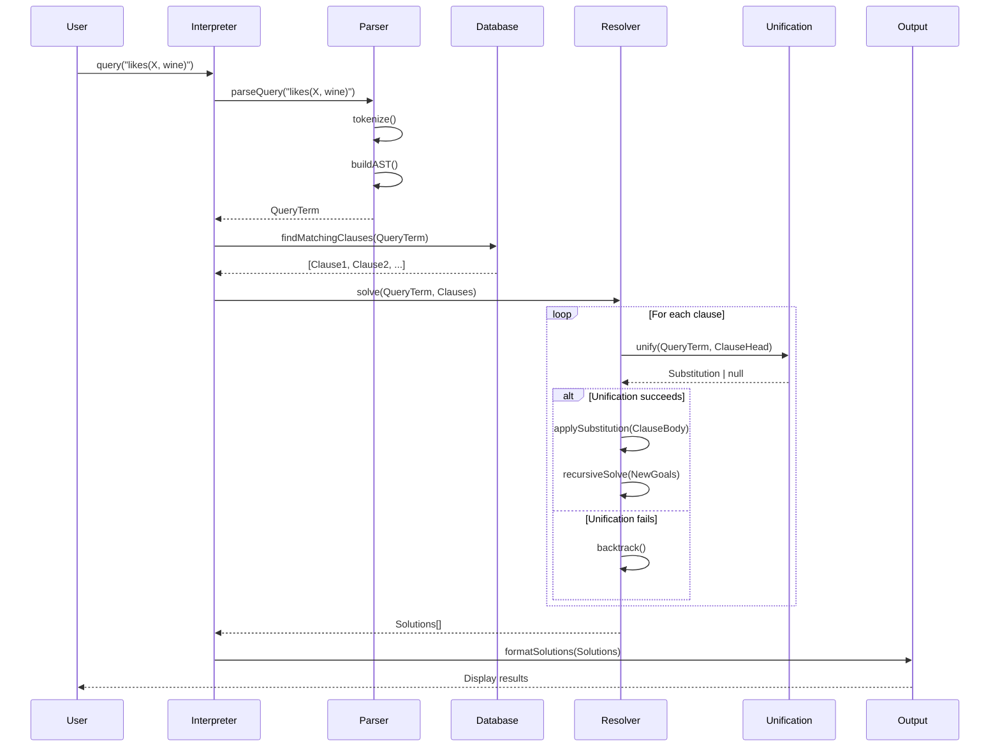
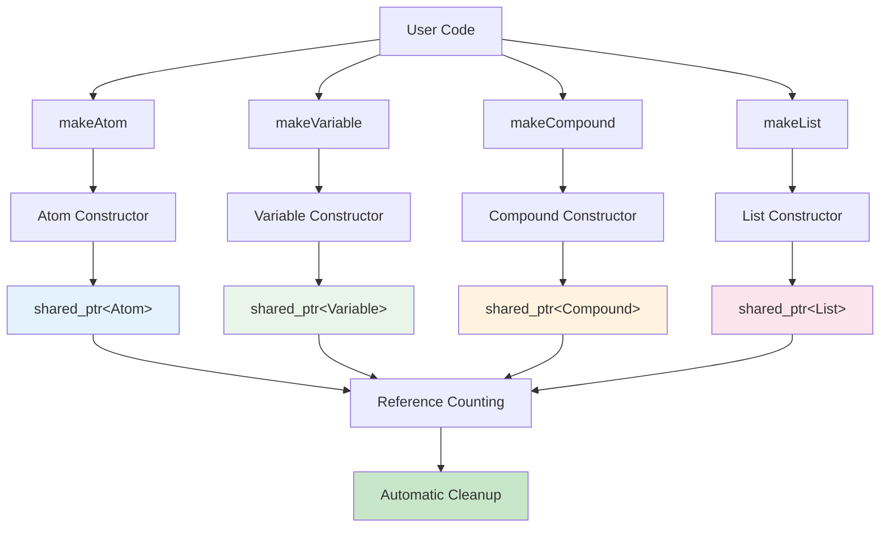
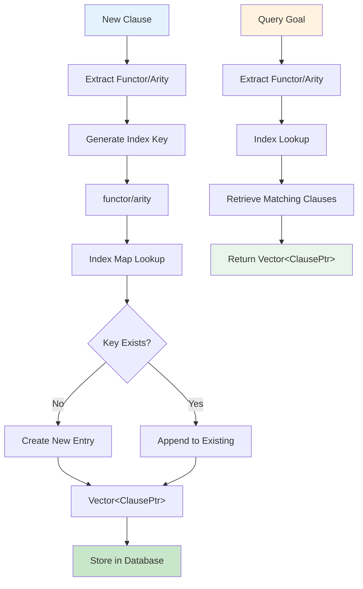
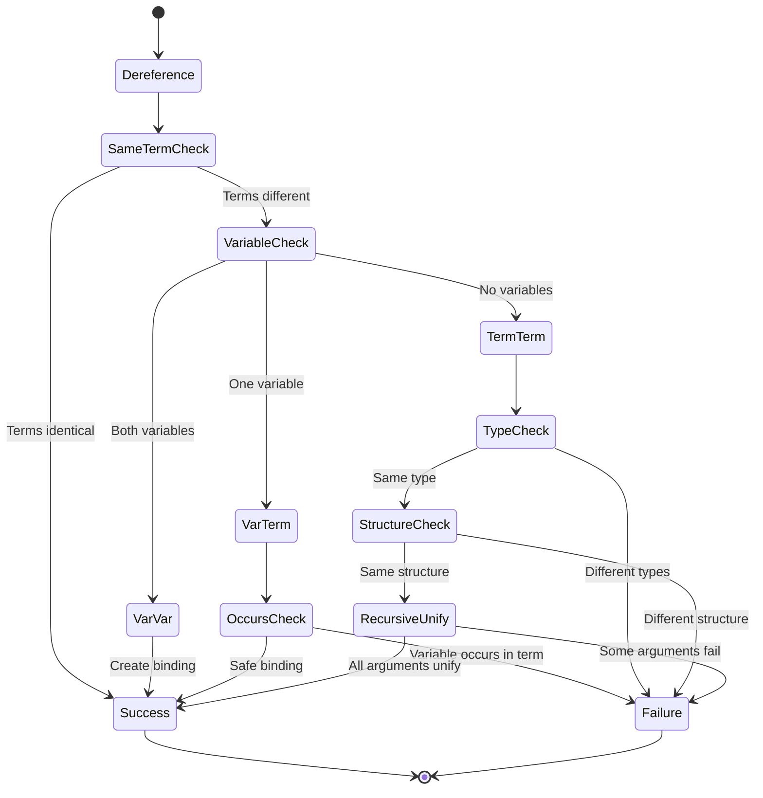
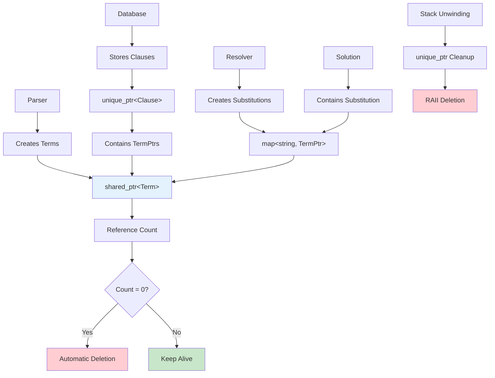
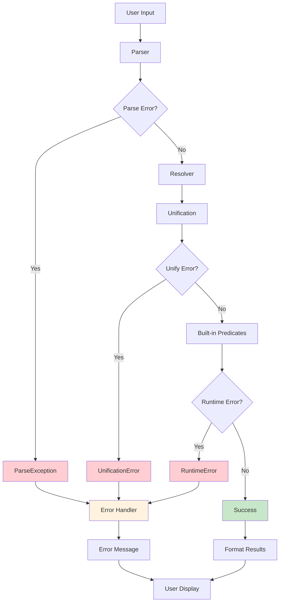
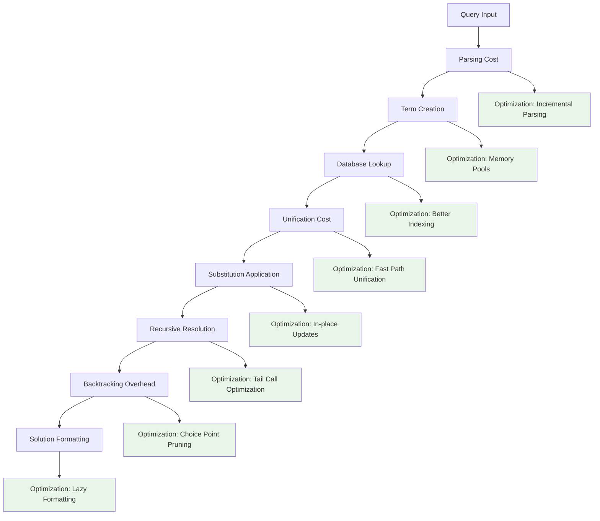
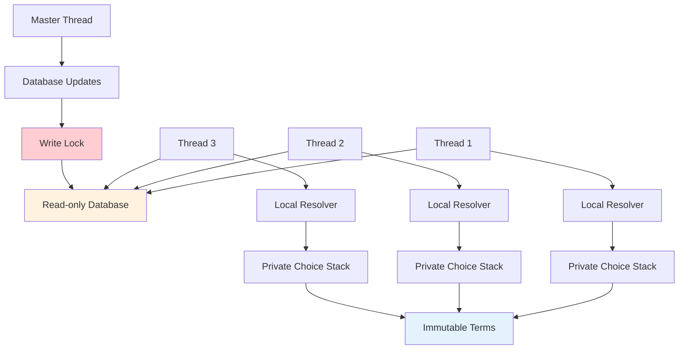

# CppLProlog Data Flow Documentation

This document illustrates the data flow through the CppLProlog interpreter using Mermaid diagrams.

## Query Execution Flow

### Complete Query Processing



## Term Creation and Management

### Term Factory Pattern



## Database Indexing System

### Clause Storage and Retrieval



## Unification Process Detail

### Step-by-Step Unification



## Resolution Tree Exploration

### Backtracking Search Space

```mermaid
graph TD
    A[Goal: likes(X, wine)] --> B[Clause 1: likes(mary, wine)]
    A --> C[Clause 2: likes(john, wine)]
    A --> D[Clause 3: likes(mary, food)]
    
    B --> E[Unify: X = mary]
    C --> F[Unify: X = john]
    D --> G[Unify: X = mary, wine ≠ food]
    
    E --> H[Success: X = mary]
    F --> I[Success: X = john]
    G --> J[Failure: Backtrack]
    
    K[Goal: happy(X)] --> L[Clause: happy(Y) :- likes(Y, wine)]
    L --> M[Unify: X = Y]
    M --> N[New Goal: likes(Y, wine)]
    N --> O[Recursive Resolution]
    O --> P[Success: X = mary, X = john]
    
    style H fill:#c8e6c9
    style I fill:#c8e6c9
    style P fill:#c8e6c9
    style J fill:#ffcdd2
```

## Memory Ownership Model

### Reference Management



## Error Propagation

### Exception Handling Flow



## Performance Optimization Points

### Bottleneck Analysis



## Concurrent Access Model (Future)

### Thread Safety Considerations

