# CppLProlog Data Flow Documentation

This document illustrates the data flow through the CppLProlog interpreter using Mermaid diagrams.

## Query Execution Flow

### Complete Query Processing

```mermaid
sequenceDiagram
    participant 👥 User as User
    participant 🧠 Interpreter as Interpreter
    participant 📝 Lexer as Lexer  
    participant 🌳 Parser as Parser
    participant 🗄️ Database as Database
    participant 🔄 Resolver as Resolver
    participant 🔗 Unification as Unification
    participant ⚡ BuiltinPredicates as BuiltinPredicates
    participant 🎨 OutputFormatter as OutputFormatter
    
    User->>+Interpreter: query("parent(tom, X)")
    Note over Interpreter: Query execution begins
    
    Interpreter->>+Lexer: tokenize("parent(tom, X)")
    Lexer-->>-Interpreter: [ATOM(parent), LPAREN, ATOM(tom), COMMA, VARIABLE(X), RPAREN]
    
    Interpreter->>+Parser: parse(tokens)
    Parser->>Parser: buildCompoundTerm()
    Parser->>Parser: validateSyntax()
    Parser-->>-Interpreter: QueryTerm: parent(tom, X)
    
    Note over Interpreter: Extract query variables: {X}
    
    Interpreter->>+Database: findMatchingClauses(parent(tom,X))
    Database->>Database: lookupByFunctor("parent")
    Database->>Database: filterByArity(2)
    Database-->>-Interpreter: [parent(tom,bob), parent(tom,liz), parent(bob,ann)]
    
    Interpreter->>+Resolver: solve(parent(tom,X), {})
    Note over Resolver: Begin SLD resolution
    
    loop For each matching clause
        Resolver->>Resolver: selectClause(parent(tom,bob))
        Resolver->>Resolver: renameVariables()
        
        Resolver->>+Unification: unify(parent(tom,X), parent(tom,bob))
        Unification->>Unification: checkTypes()
        Unification->>Unification: unifyArguments()
        Unification->>Unification: occursCheck(X, bob)
        Unification-->>-Resolver: Success: {X → bob}
        
        alt Clause is fact (no body)
            Resolver->>Resolver: goalResolved()
            Resolver-->>Interpreter: Solution: {X → bob}
        else Clause has body goals
            Resolver->>Resolver: addBodyGoals()
            Resolver->>Resolver: applySubstitution()
            Resolver->>+Resolver: recursiveSolve(newGoals)
            Resolver-->>-Resolver: Solutions
        end
        
        Note over Resolver: Continue with next clause for backtracking
        
        Resolver->>+Unification: unify(parent(tom,X), parent(tom,liz))
        Unification-->>-Resolver: Success: {X → liz}
        Resolver-->>Interpreter: Solution: {X → liz}
    end
    
    Resolver-->>-Interpreter: AllSolutions: [{X → bob}, {X → liz}]
    
    Interpreter->>+OutputFormatter: formatSolutions(solutions, {X})
    OutputFormatter->>OutputFormatter: filterQueryVariables()
    OutputFormatter->>OutputFormatter: formatBindings()
    OutputFormatter-->>-Interpreter: ["X = bob", "X = liz"]
    
    Interpreter-->>-User: 🎨 Display: "X = bob ; X = liz"
    
    rect rgba(200, 230, 201, 0.3)
        Note over User, OutputFormatter: Success: Query resolved with 2 solutions
    end
```

## Term Creation and Management

### Term Factory Pattern & Lifecycle

```mermaid
flowchart TD
    subgraph "Term Creation Layer"
        UC["👥 User/Parser Code<br/>Requests new terms"]
        
        FA["🏠 makeAtom(name)<br/>Factory function"]
        FV["🏠 makeVariable(name)<br/>Factory function"]
        FC["🏠 makeCompound(functor, args)<br/>Factory function"]
        FL["🏠 makeList(elements, tail)<br/>Factory function"]
    end
    
    subgraph "Construction Layer"
        CA["🔨 Atom Constructor<br/>Atom(string name)"]
        CV["🔨 Variable Constructor<br/>Variable(string name)"]
        CC["🔨 Compound Constructor<br/>Compound(functor, TermList)"]
        CL["🔨 List Constructor<br/>List(TermList, TermPtr)"]
    end
    
    subgraph "Smart Pointer Wrapping"
        SPA["🧠 shared_ptr<Atom><br/>Reference counting enabled"]
        SPV["🧠 shared_ptr<Variable><br/>Reference counting enabled"]
        SPC["🧠 shared_ptr<Compound><br/>Reference counting enabled"]
        SPL["🧠 shared_ptr<List><br/>Reference counting enabled"]
    end
    
    subgraph "Memory Management"
        RC["📊 Reference Counter<br/>• Atomic increment/decrement<br/>• Thread-safe operations<br/>• Automatic tracking"]
        
        CC_CHECK{"🔍 Reference Count == 0?<br/>Time for cleanup?"}
        
        CLEANUP["🗑️ Automatic Cleanup<br/>• Destructor called<br/>• Memory released<br/>• Child references decremented"]
        
        KEEP_ALIVE["✨ Keep Alive<br/>• Active references exist<br/>• Memory preserved<br/>• Available for use"]
    end
    
    subgraph "Usage Contexts"
        PARSER_USE["🌳 Parser Usage<br/>Create AST nodes"]
        RESOLVER_USE["🔄 Resolver Usage<br/>Term manipulation"]
        UNIFY_USE["🔗 Unification Usage<br/>Pattern matching"]
        USER_USE["👥 User API Usage<br/>Programmatic access"]
    end
    
    UC --> FA
    UC --> FV  
    UC --> FC
    UC --> FL
    
    FA --> CA --> SPA
    FV --> CV --> SPV
    FC --> CC --> SPC
    FL --> CL --> SPL
    
    SPA --> RC
    SPV --> RC
    SPC --> RC
    SPL --> RC
    
    RC --> CC_CHECK
    CC_CHECK -->|"✅ Yes"| CLEANUP
    CC_CHECK -->|"❌ No"| KEEP_ALIVE
    
    SPA --> PARSER_USE
    SPV --> RESOLVER_USE
    SPC --> UNIFY_USE
    SPL --> USER_USE
    
    PARSER_USE --> RC
    RESOLVER_USE --> RC
    UNIFY_USE --> RC
    USER_USE --> RC
    
    CLEANUP -.-> |"🔄 May trigger"| CC_CHECK
    
    classDef factory fill:#e3f2fd,stroke:#1976d2,stroke-width:2px
    classDef construct fill:#fff3e0,stroke:#f57c00,stroke-width:2px
    classDef smartptr fill:#e8f5e8,stroke:#388e3c,stroke-width:2px
    classDef memory fill:#fce4ec,stroke:#c2185b,stroke-width:2px
    classDef usage fill:#f3e5f5,stroke:#7b1fa2,stroke-width:2px
    classDef cleanup fill:#ffcdd2,stroke:#d32f2f,stroke-width:2px
    classDef alive fill:#c8e6c9,stroke:#388e3c,stroke-width:2px
    
    class UC,FA,FV,FC,FL factory
    class CA,CV,CC,CL construct
    class SPA,SPV,SPC,SPL smartptr
    class RC,CC_CHECK memory
    class PARSER_USE,RESOLVER_USE,UNIFY_USE,USER_USE usage
    class CLEANUP cleanup
    class KEEP_ALIVE alive
```



## Database Indexing System

### Database Storage and Indexing System

```mermaid
flowchart TB
    subgraph "Clause Input Processing"
        INPUT["📝 Input: parent(tom, bob).<br/>Raw Prolog clause"]
        PARSE_CLAUSE["🌳 Parse Clause<br/>• Extract head term<br/>• Extract body goals<br/>• Validate syntax"]
        CREATE_CLAUSE["🔨 Create Clause Object<br/>• Head: parent(tom, bob)<br/>• Body: [] (fact)<br/>• Unique ID assigned"]
    end
    
    subgraph "Index Key Generation"
        EXTRACT_SIG["🔍 Extract Signature<br/>• Functor: 'parent'<br/>• Arity: 2<br/>• Key: 'parent/2'"]
        HASH_KEY["⚙️ Generate Hash<br/>std::hash<string>('parent/2')"]
    end
    
    subgraph "Database Storage Layer"
        CLAUSE_VEC["📚 Clause Vector<br/>vector<unique_ptr<Clause>><br/>[0] parent(tom,bob)<br/>[1] parent(tom,liz)<br/>[2] parent(bob,ann)"]
        
        INDEX_MAP["🗺️ Index Map<br/>unordered_map<string, vector<size_t>><br/>{'parent/2' → [0,1,2]}<br/>{'likes/2' → [3,4,5]}"]
    end
    
    subgraph "Storage Decision Logic"
        KEY_EXISTS{"🔍 Key 'parent/2'<br/>already exists?"}
        CREATE_ENTRY["➕ Create New Entry<br/>index_['parent/2'] = [0]"]
        APPEND_ENTRY["➕ Append to Existing<br/>index_['parent/2'].push_back(1)"]
    end
    
    subgraph "Query Processing Flow"
        QUERY_IN["🎯 Query: parent(tom, X)<br/>Goal term for resolution"]
        EXTRACT_QUERY_SIG["🔍 Extract Query Signature<br/>• Functor: 'parent'<br/>• Arity: 2<br/>• Key: 'parent/2'"]
        LOOKUP_INDEX["🔍 Index Lookup<br/>index_['parent/2']"]
        GET_INDICES["📊 Retrieve Indices<br/>Found: [0, 1, 2]"]
        FETCH_CLAUSES["🔄 Fetch Clauses<br/>clauses_[0], clauses_[1], clauses_[2]"]
        RETURN_CLAUSES["🚀 Return Matching<br/>[parent(tom,bob), parent(tom,liz), parent(bob,ann)]"]
    end
    
    subgraph "Performance Optimization"
        CACHE_LOCALITY["🚀 Cache Locality<br/>• Contiguous vector storage<br/>• Sequential access pattern<br/>• CPU cache friendly"]
        HASH_PERF["⚡ Hash Performance<br/>• O(1) average lookup<br/>• Minimal collision rate<br/>• Fast string hashing"]
    end
    
    INPUT --> PARSE_CLAUSE
    PARSE_CLAUSE --> CREATE_CLAUSE
    CREATE_CLAUSE --> EXTRACT_SIG
    EXTRACT_SIG --> HASH_KEY
    
    HASH_KEY --> KEY_EXISTS
    KEY_EXISTS -->|"❌ No"| CREATE_ENTRY
    KEY_EXISTS -->|"✅ Yes"| APPEND_ENTRY
    
    CREATE_ENTRY --> INDEX_MAP
    APPEND_ENTRY --> INDEX_MAP
    
    CREATE_CLAUSE --> CLAUSE_VEC
    INDEX_MAP -.-> CLAUSE_VEC
    
    QUERY_IN --> EXTRACT_QUERY_SIG
    EXTRACT_QUERY_SIG --> LOOKUP_INDEX
    LOOKUP_INDEX --> GET_INDICES
    GET_INDICES --> FETCH_CLAUSES
    FETCH_CLAUSES --> RETURN_CLAUSES
    
    INDEX_MAP --> LOOKUP_INDEX
    CLAUSE_VEC --> FETCH_CLAUSES
    
    CLAUSE_VEC --> CACHE_LOCALITY
    INDEX_MAP --> HASH_PERF
    
    classDef input fill:#e3f2fd,stroke:#1976d2,stroke-width:2px
    classDef processing fill:#fff3e0,stroke:#f57c00,stroke-width:2px
    classDef storage fill:#e8f5e8,stroke:#388e3c,stroke-width:2px
    classDef logic fill:#fce4ec,stroke:#c2185b,stroke-width:2px
    classDef query fill:#f3e5f5,stroke:#7b1fa2,stroke-width:2px
    classDef performance fill:#c8e6c9,stroke:#388e3c,stroke-width:2px
    
    class INPUT,PARSE_CLAUSE,CREATE_CLAUSE input
    class EXTRACT_SIG,HASH_KEY processing
    class CLAUSE_VEC,INDEX_MAP storage
    class KEY_EXISTS,CREATE_ENTRY,APPEND_ENTRY logic
    class QUERY_IN,EXTRACT_QUERY_SIG,LOOKUP_INDEX,GET_INDICES,FETCH_CLAUSES,RETURN_CLAUSES query
    class CACHE_LOCALITY,HASH_PERF performance
```



## Unification Process Detail

### Detailed Unification State Machine


## Resolution Tree Exploration

### Resolution Search Tree with Backtracking


## Memory Ownership Model

### Memory Ownership and Reference Flow

```mermaid
flowchart TB
    subgraph "Term Creation Sources"
        PARSER_CREATE["🌳 Parser Creates<br/>• Parse input text<br/>• Build AST nodes<br/>• makeAtom(), makeCompound()"]
        
        USER_CREATE["👥 User API Creates<br/>• Programmatic construction<br/>• Factory functions<br/>• Custom term building"]
        
        RESOLVER_CREATE["🔄 Resolver Creates<br/>• Variable renaming<br/>• Term cloning<br/>• Substitution application"]
    end
    
    subgraph "Smart Pointer Management"
        SHARED_PTR["🧠 shared_ptr<Term><br/>• Automatic ref counting<br/>• Thread-safe operations<br/>• Weak pointer support<br/>• Custom deleters"]
        
        REF_COUNTER["📊 Reference Counter<br/>• Atomic increment/decrement<br/>• Use count tracking<br/>• Weak reference handling<br/>• Cycle detection ready"]
    end
    
    subgraph "Storage Containers"
        DATABASE_STORAGE["🗄️ Database Storage<br/>• vector<unique_ptr<Clause>><br/>• Clause owns TermPtrs<br/>• RAII lifetime management<br/>• Contiguous memory layout"]
        
        SUBSTITUTION_MAP["🗺️ Substitution Maps<br/>• unordered_map<string, TermPtr><br/>• Variable bindings<br/>• Copy semantics<br/>• Scoped lifetime"]
        
        SOLUTION_CONTAINER["🎨 Solution Objects<br/>• Contains substitution maps<br/>• Filtered query variables<br/>• User-facing results<br/>• Value semantics"]
    end
    
    subgraph "Reference Flow Patterns"
        SHARING["🔗 Reference Sharing<br/>• Multiple containers reference same term<br/>• Parser → Database → Resolver<br/>• No unnecessary copying<br/>• Efficient memory usage"]
        
        LIFECYCLE["🔄 Lifecycle Management<br/>• Creation: ref count = 1<br/>• Sharing: ref count++<br/>• Release: ref count--<br/>• Destruction: ref count = 0"]
    end
    
    subgraph "Memory Cleanup Decision"
        REF_CHECK{"🔍 Reference Count Check<br/>Are there active references?"}
        
        KEEP_ALIVE["✨ Keep Alive<br/>• Active references exist<br/>• Term remains in memory<br/>• Available for continued use<br/>• Shared across contexts"]
        
        AUTO_DELETE["🗑️ Automatic Deletion<br/>• No active references<br/>• Destructor called<br/>• Memory released to OS<br/>• Child references decremented"]
    end
    
    subgraph "RAII Cleanup Scenarios"
        SCOPE_EXIT["🚀 Scope Exit<br/>• Local variables destroyed<br/>• Stack unwinding<br/>• Automatic cleanup<br/>• Exception safety"]
        
        CONTAINER_CLEAR["🧹 Container Clear<br/>• Database reset<br/>• Vector clearing<br/>• Map destruction<br/>• Bulk cleanup"]
        
        EXCEPTION_UNWIND["⚠️ Exception Unwinding<br/>• Stack unwinding<br/>• RAII guarantees<br/>• No memory leaks<br/>• Clean state restoration"]
    end
    
    PARSER_CREATE --> SHARED_PTR
    USER_CREATE --> SHARED_PTR
    RESOLVER_CREATE --> SHARED_PTR
    
    SHARED_PTR --> REF_COUNTER
    SHARED_PTR --> DATABASE_STORAGE
    SHARED_PTR --> SUBSTITUTION_MAP
    SHARED_PTR --> SOLUTION_CONTAINER
    
    DATABASE_STORAGE --> SHARING
    SUBSTITUTION_MAP --> SHARING
    SOLUTION_CONTAINER --> SHARING
    
    SHARING --> LIFECYCLE
    REF_COUNTER --> LIFECYCLE
    
    LIFECYCLE --> REF_CHECK
    REF_CHECK -->|"✅ Yes"| KEEP_ALIVE
    REF_CHECK -->|"❌ No"| AUTO_DELETE
    
    AUTO_DELETE -.-> |"🔄 May trigger child cleanup"| REF_CHECK
    
    SCOPE_EXIT --> REF_CHECK
    CONTAINER_CLEAR --> REF_CHECK
    EXCEPTION_UNWIND --> REF_CHECK
    
    classDef creation fill:#e3f2fd,stroke:#1976d2,stroke-width:2px
    classDef smartptr fill:#fff3e0,stroke:#f57c00,stroke-width:2px
    classDef storage fill:#e8f5e8,stroke:#388e3c,stroke-width:2px
    classDef flow fill:#fce4ec,stroke:#c2185b,stroke-width:2px
    classDef cleanup fill:#f3e5f5,stroke:#7b1fa2,stroke-width:2px
    classDef decision fill:#e0f2f1,stroke:#00695c,stroke-width:2px
    classDef alive fill:#c8e6c9,stroke:#388e3c,stroke-width:2px
    classDef delete fill:#ffcdd2,stroke:#d32f2f,stroke-width:2px
    
    class PARSER_CREATE,USER_CREATE,RESOLVER_CREATE creation
    class SHARED_PTR,REF_COUNTER smartptr
    class DATABASE_STORAGE,SUBSTITUTION_MAP,SOLUTION_CONTAINER storage
    class SHARING,LIFECYCLE flow
    class SCOPE_EXIT,CONTAINER_CLEAR,EXCEPTION_UNWIND cleanup
    class REF_CHECK decision
    class KEEP_ALIVE alive
    class AUTO_DELETE delete
```



## Error Propagation

### Comprehensive Error Handling and Recovery Flow

```mermaid
flowchart TD
    subgraph "Error Sources"
        USER_INPUT["👥 User Input<br/>Query string, file path"]
        FILE_OPS["📁 File Operations<br/>Loading .pl files"]
        SYSTEM_STATE["⚙️ System State<br/>Memory, resources"]
    end
    
    subgraph "Lexical Analysis Errors"
        LEX_PROCESS["📝 Lexer Processing<br/>Tokenization phase"]
        LEX_ERROR_CHECK{"⚠️ Lexical Errors?<br/>Invalid characters, syntax"}
        LEX_EXCEPTION["🚫 ParseException<br/>• Invalid token<br/>• Malformed string<br/>• Unexpected character<br/>• Position info preserved"]
    end
    
    subgraph "Syntax Analysis Errors"
        PARSE_PROCESS["🌳 Parser Processing<br/>AST construction phase"]
        PARSE_ERROR_CHECK{"⚠️ Syntax Errors?<br/>Grammar violations"}
        PARSE_EXCEPTION["🚫 ParseException<br/>• Missing operators<br/>• Unbalanced parentheses<br/>• Invalid clause structure<br/>• Error recovery attempted"]
    end
    
    subgraph "Runtime Processing Errors"
        RESOLUTION["🔄 Resolution Engine<br/>Query processing"]
        UNIFICATION["🔗 Unification Process<br/>Term matching"]
        BUILTINS["⚡ Built-in Predicates<br/>System predicates"]
        
        RUNTIME_ERROR_CHECK{"⚠️ Runtime Errors?<br/>Processing failures"}
        
        UNIFY_ERROR["🚫 UnificationError<br/>• Occurs check violation<br/>• Type mismatch<br/>• Infinite structure<br/>• Memory issues"]
        
        RUNTIME_ERROR["🚫 RuntimeError<br/>• Built-in failures<br/>• Stack overflow<br/>• Resource exhaustion<br/>• System limitations"]
        
        SYSTEM_ERROR["🚫 SystemError<br/>• Memory allocation failure<br/>• File I/O errors<br/>• OS resource limits<br/>• Hardware issues"]
    end
    
    subgraph "Error Handling Strategy"
        ERROR_CATCHER["🎯 Exception Handler<br/>• Try-catch blocks<br/>• Type-specific handling<br/>• Context preservation<br/>• Stack trace capture"]
        
        ERROR_ANALYSIS["🔍 Error Analysis<br/>• Error classification<br/>• Severity assessment<br/>• Recovery possibility<br/>• User impact evaluation"]
        
        RECOVERY_ATTEMPT["🔧 Recovery Attempt<br/>• Partial state restoration<br/>• Resource cleanup<br/>• Alternative strategies<br/>• Graceful degradation"]
    end
    
    subgraph "User Communication"
        MSG_FORMATTER["🎨 Message Formatter<br/>• User-friendly language<br/>• Context information<br/>• Suggested fixes<br/>• Error codes"]
        
        ERROR_DISPLAY["📺 Error Display<br/>• Colored output<br/>• Position highlighting<br/>• Multi-line context<br/>• Severity indicators"]
        
        RECOVERY_OPTIONS["🛠️ Recovery Options<br/>• Retry mechanisms<br/>• Alternative inputs<br/>• Help suggestions<br/>• State reset options"]
    end
    
    subgraph "Success Path"
        SUCCESS_PROCESSING["✅ Successful Processing<br/>No errors encountered"]
        RESULT_FORMATTER["🎨 Result Formatter<br/>Format successful results"]
        SUCCESS_DISPLAY["📺 Success Display<br/>Show query results"]
    end
    
    subgraph "System State Management"
        STATE_CLEANUP["🧹 State Cleanup<br/>• Memory deallocation<br/>• Resource release<br/>• Handler stack unwinding<br/>• Clean slate preparation"]
        
        STATE_PRESERVATION["💾 State Preservation<br/>• Database integrity<br/>• User session continuity<br/>• Configuration retention<br/>• History maintenance"]
    end
    
    USER_INPUT --> LEX_PROCESS
    FILE_OPS --> LEX_PROCESS
    SYSTEM_STATE --> LEX_PROCESS
    
    LEX_PROCESS --> LEX_ERROR_CHECK
    LEX_ERROR_CHECK -->|"❌ Yes"| LEX_EXCEPTION
    LEX_ERROR_CHECK -->|"✅ No"| PARSE_PROCESS
    
    PARSE_PROCESS --> PARSE_ERROR_CHECK
    PARSE_ERROR_CHECK -->|"❌ Yes"| PARSE_EXCEPTION
    PARSE_ERROR_CHECK -->|"✅ No"| RESOLUTION
    
    RESOLUTION --> UNIFICATION
    UNIFICATION --> BUILTINS
    BUILTINS --> RUNTIME_ERROR_CHECK
    
    RUNTIME_ERROR_CHECK -->|"❌ Yes"| UNIFY_ERROR
    RUNTIME_ERROR_CHECK -->|"❌ Yes"| RUNTIME_ERROR
    RUNTIME_ERROR_CHECK -->|"❌ Yes"| SYSTEM_ERROR
    RUNTIME_ERROR_CHECK -->|"✅ No"| SUCCESS_PROCESSING
    
    LEX_EXCEPTION --> ERROR_CATCHER
    PARSE_EXCEPTION --> ERROR_CATCHER
    UNIFY_ERROR --> ERROR_CATCHER
    RUNTIME_ERROR --> ERROR_CATCHER
    SYSTEM_ERROR --> ERROR_CATCHER
    
    ERROR_CATCHER --> ERROR_ANALYSIS
    ERROR_ANALYSIS --> RECOVERY_ATTEMPT
    RECOVERY_ATTEMPT --> MSG_FORMATTER
    
    MSG_FORMATTER --> ERROR_DISPLAY
    ERROR_DISPLAY --> RECOVERY_OPTIONS
    
    SUCCESS_PROCESSING --> RESULT_FORMATTER
    RESULT_FORMATTER --> SUCCESS_DISPLAY
    
    ERROR_CATCHER --> STATE_CLEANUP
    STATE_CLEANUP --> STATE_PRESERVATION
    
    RECOVERY_OPTIONS -.-> |"🔄 Retry"| USER_INPUT
    
    classDef input fill:#e3f2fd,stroke:#1976d2,stroke-width:2px
    classDef processing fill:#fff3e0,stroke:#f57c00,stroke-width:2px
    classDef error fill:#ffcdd2,stroke:#d32f2f,stroke-width:2px
    classDef handling fill:#f3e5f5,stroke:#7b1fa2,stroke-width:2px
    classDef communication fill:#e0f2f1,stroke:#00695c,stroke-width:2px
    classDef success fill:#c8e6c9,stroke:#388e3c,stroke-width:2px
    classDef state fill:#fce4ec,stroke:#c2185b,stroke-width:2px
    
    class USER_INPUT,FILE_OPS,SYSTEM_STATE input
    class LEX_PROCESS,PARSE_PROCESS,RESOLUTION,UNIFICATION,BUILTINS processing
    class LEX_EXCEPTION,PARSE_EXCEPTION,UNIFY_ERROR,RUNTIME_ERROR,SYSTEM_ERROR,LEX_ERROR_CHECK,PARSE_ERROR_CHECK,RUNTIME_ERROR_CHECK error
    class ERROR_CATCHER,ERROR_ANALYSIS,RECOVERY_ATTEMPT handling
    class MSG_FORMATTER,ERROR_DISPLAY,RECOVERY_OPTIONS communication
    class SUCCESS_PROCESSING,RESULT_FORMATTER,SUCCESS_DISPLAY success
    class STATE_CLEANUP,STATE_PRESERVATION state
```



## Performance Optimization Points

### Performance Analysis and Optimization Opportunities

```mermaid
flowchart TD
    subgraph "Query Processing Pipeline"
        INPUT["📝 Query Input<br/>Raw string processing"]
        PARSE_STAGE["🌳 Parsing Stage<br/>• Lexical analysis<br/>• Syntax parsing<br/>• AST construction"]
        TERM_CREATE["🔨 Term Creation<br/>• Object allocation<br/>• Smart pointer wrapping<br/>• Type initialization"]
        DB_LOOKUP["🗄️ Database Lookup<br/>• Index traversal<br/>• Clause retrieval<br/>• Functor matching"]
        UNIFY_STAGE["🔗 Unification Stage<br/>• Term comparison<br/>• Variable binding<br/>• Occurs checking"]
        SUBST_APPLY["⚡ Substitution Application<br/>• Variable replacement<br/>• Term traversal<br/>• Map lookups"]
        RECURSIVE_RES["🔄 Recursive Resolution<br/>• Goal processing<br/>• Stack management<br/>• Choice points"]
        BACKTRACK["⬅️ Backtracking<br/>• State restoration<br/>• Alternative exploration<br/>• Stack unwinding"]
        FORMAT_OUT["🎨 Output Formatting<br/>• Solution filtering<br/>• String conversion<br/>• Display preparation"]
    end
    
    subgraph "Performance Bottlenecks"
        PARSE_COST["🐌 Parsing Bottleneck<br/>• String processing overhead<br/>• Recursive descent cost<br/>• Error handling branches<br/>• Token creation expense"]
        
        MEMORY_ALLOC["🐌 Memory Allocation<br/>• frequent new/delete<br/>• Heap fragmentation<br/>• Constructor/destructor cost<br/>• Reference counting overhead"]
        
        INDEX_INEFFICIENT["🐌 Indexing Limitations<br/>• Hash map collisions<br/>• Linear clause scanning<br/>• Cache misses<br/>• String key comparisons"]
        
        UNIFY_COMPLEXITY["🐌 Unification Complexity<br/>• Deep term traversal<br/>• Occurs check expense<br/>• Recursive comparisons<br/>• Type checking overhead"]
        
        BACKTRACK_OVERHEAD["🐌 Backtracking Cost<br/>• Choice point creation<br/>• State copying<br/>• Stack management<br/>• Alternative enumeration"]
    end
    
    subgraph "Optimization Strategies"
        OPT_PARSE["🚀 Parsing Optimizations<br/>• Incremental parsing<br/>• Token caching<br/>• Lazy evaluation<br/>• Fast path recognition"]
        
        OPT_MEMORY["🚀 Memory Optimizations<br/>• Object pooling<br/>• Arena allocation<br/>• Copy-on-write<br/>• Reference optimization"]
        
        OPT_INDEX["🚀 Indexing Improvements<br/>• First-argument indexing<br/>• Multi-level indices<br/>• Bloom filters<br/>• Cache-friendly structures"]
        
        OPT_UNIFY["🚀 Unification Speedup<br/>• Fast-path detection<br/>• Shallow comparison first<br/>• SIMD operations<br/>• Memoization"]
        
        OPT_RESOLUTION["🚀 Resolution Enhancements<br/>• Tail call optimization<br/>• Cut implementation<br/>• Deterministic paths<br/>• Goal reordering"]
        
        OPT_BACKTRACK["🚀 Backtracking Reduction<br/>• Choice point pruning<br/>• Early failure detection<br/>• Intelligent clause ordering<br/>• Constraint propagation"]
        
        OPT_FORMAT["🚀 Formatting Optimization<br/>• Lazy string building<br/>• Template formatting<br/>• Cached representations<br/>• Stream-based output"]
    end
    
    subgraph "Performance Metrics"
        METRICS["📊 Performance Indicators<br/>• Queries per second<br/>• Memory usage peaks<br/>• Cache hit ratios<br/>• Backtrack frequency<br/>• Parse time breakdown"]
        
        BENCHMARKS["🏁 Benchmark Results<br/>• Fact queries: ~100ns<br/>• Simple rules: ~500ns<br/>• Complex rules: ~2μs<br/>• Memory per term: ~64 bytes"]
    end
    
    INPUT --> PARSE_STAGE
    PARSE_STAGE --> TERM_CREATE
    TERM_CREATE --> DB_LOOKUP
    DB_LOOKUP --> UNIFY_STAGE
    UNIFY_STAGE --> SUBST_APPLY
    SUBST_APPLY --> RECURSIVE_RES
    RECURSIVE_RES --> BACKTRACK
    BACKTRACK --> FORMAT_OUT
    
    PARSE_STAGE -.-> PARSE_COST
    TERM_CREATE -.-> MEMORY_ALLOC
    DB_LOOKUP -.-> INDEX_INEFFICIENT
    UNIFY_STAGE -.-> UNIFY_COMPLEXITY
    BACKTRACK -.-> BACKTRACK_OVERHEAD
    
    PARSE_COST --> OPT_PARSE
    MEMORY_ALLOC --> OPT_MEMORY
    INDEX_INEFFICIENT --> OPT_INDEX
    UNIFY_COMPLEXITY --> OPT_UNIFY
    RECURSIVE_RES --> OPT_RESOLUTION
    BACKTRACK_OVERHEAD --> OPT_BACKTRACK
    FORMAT_OUT --> OPT_FORMAT
    
    OPT_PARSE --> METRICS
    OPT_MEMORY --> METRICS
    OPT_INDEX --> METRICS
    OPT_UNIFY --> METRICS
    OPT_RESOLUTION --> METRICS
    OPT_BACKTRACK --> METRICS
    OPT_FORMAT --> METRICS
    
    METRICS --> BENCHMARKS
    
    classDef pipeline fill:#e3f2fd,stroke:#1976d2,stroke-width:2px
    classDef bottleneck fill:#ffcdd2,stroke:#d32f2f,stroke-width:2px
    classDef optimization fill:#c8e6c9,stroke:#388e3c,stroke-width:2px
    classDef metrics fill:#fff3e0,stroke:#f57c00,stroke-width:2px
    
    class INPUT,PARSE_STAGE,TERM_CREATE,DB_LOOKUP,UNIFY_STAGE,SUBST_APPLY,RECURSIVE_RES,BACKTRACK,FORMAT_OUT pipeline
    class PARSE_COST,MEMORY_ALLOC,INDEX_INEFFICIENT,UNIFY_COMPLEXITY,BACKTRACK_OVERHEAD bottleneck
    class OPT_PARSE,OPT_MEMORY,OPT_INDEX,OPT_UNIFY,OPT_RESOLUTION,OPT_BACKTRACK,OPT_FORMAT optimization
    class METRICS,BENCHMARKS metrics
```



## Concurrent Access Model (Future Enhancement)

### Future Concurrency Model (Planned Enhancement)

```mermaid
flowchart TB
    subgraph "Current Single-Threaded Design"
        CURRENT["🔒 Single-Threaded Operation<br/>• One query at a time<br/>• Sequential processing<br/>• Simple debugging<br/>• No synchronization overhead"]
    end
    
    subgraph "Shared Read-Only Resources"
        IMMUTABLE_TERMS["🏷️ Immutable Terms<br/>• No modification after creation<br/>• Thread-safe by design<br/>• Shareable across contexts<br/>• Reference counting safe"]
        
        DATABASE_RO["🗄️ Read-Only Database<br/>• Clause storage<br/>• Index structures<br/>• Concurrent read access<br/>• No modification during queries"]
        
        BUILTIN_REGISTRY["⚡ Built-in Predicate Registry<br/>• Function pointers<br/>• Stateless operations<br/>• Thread-safe by design<br/>• Global accessibility"]
    end
    
    subgraph "Thread-Local State"
        THREAD1["🧵 Query Thread 1<br/>Independent execution context"]
        THREAD2["🧵 Query Thread 2<br/>Independent execution context"]
        THREAD3["🧵 Query Thread 3<br/>Independent execution context"]
        
        RESOLVER1["🔄 Local Resolver 1<br/>• Private choice stack<br/>• Local substitutions<br/>• Independent backtracking<br/>• No shared state"]
        
        RESOLVER2["🔄 Local Resolver 2<br/>• Private choice stack<br/>• Local substitutions<br/>• Independent backtracking<br/>• No shared state"]
        
        RESOLVER3["🔄 Local Resolver 3<br/>• Private choice stack<br/>• Local substitutions<br/>• Independent backtracking<br/>• No shared state"]
        
        CHOICE_STACK1["📚 Choice Stack 1<br/>Thread-local backtracking"]
        CHOICE_STACK2["📚 Choice Stack 2<br/>Thread-local backtracking"]
        CHOICE_STACK3["📚 Choice Stack 3<br/>Thread-local backtracking"]
    end
    
    subgraph "Synchronization Layer (Future)"
        COORDINATOR["🎯 Query Coordinator<br/>• Thread pool management<br/>• Work distribution<br/>• Result aggregation<br/>• Load balancing"]
        
        RW_LOCK["🔒 Reader-Writer Lock<br/>• Multiple concurrent readers<br/>• Exclusive writer access<br/>• Database update protection<br/>• Minimal contention"]
        
        ATOMIC_UPDATES["⚛️ Atomic Operations<br/>• Reference counting<br/>• Statistics updates<br/>• Memory management<br/>• Lock-free where possible"]
    end
    
    subgraph "Database Modification Control"
        MASTER_WRITER["🖋️ Master Writer Thread<br/>• Exclusive database access<br/>• Clause loading<br/>• Index updates<br/>• Schema modifications"]
        
        UPDATE_QUEUE["📦 Update Queue<br/>• Batched modifications<br/>• Atomic transactions<br/>• Rollback capability<br/>• Consistency guarantees"]
        
        VERSIONING["📅 Database Versioning<br/>• Snapshot isolation<br/>• Copy-on-write updates<br/>• Version compatibility<br/>• Graceful migration"]
    end
    
    subgraph "Parallel Resolution Opportunities"
        CHOICE_PARALLEL["🌀 Parallel Choice Exploration<br/>• Distribute choice points<br/>• Independent branch processing<br/>• Result merging<br/>• Work stealing"]
        
        GOAL_PARALLEL["🎯 Goal-Level Parallelism<br/>• Independent goal resolution<br/>• Conjunction parallelization<br/>• Dependency analysis<br/>• Synchronization points"]
        
        QUERY_PARALLEL["🔄 Query-Level Parallelism<br/>• Multiple query processing<br/>• Batch operations<br/>• Resource sharing<br/>• Priority scheduling"]
    end
    
    CURRENT -.-> |"🔄 Future Enhancement"| COORDINATOR
    
    THREAD1 --> RESOLVER1
    THREAD2 --> RESOLVER2
    THREAD3 --> RESOLVER3
    
    RESOLVER1 --> CHOICE_STACK1
    RESOLVER2 --> CHOICE_STACK2
    RESOLVER3 --> CHOICE_STACK3
    
    RESOLVER1 --> IMMUTABLE_TERMS
    RESOLVER2 --> IMMUTABLE_TERMS
    RESOLVER3 --> IMMUTABLE_TERMS
    
    IMMUTABLE_TERMS --> DATABASE_RO
    DATABASE_RO --> BUILTIN_REGISTRY
    
    COORDINATOR --> RW_LOCK
    RW_LOCK --> DATABASE_RO
    RW_LOCK --> MASTER_WRITER
    
    MASTER_WRITER --> UPDATE_QUEUE
    UPDATE_QUEUE --> VERSIONING
    
    COORDINATOR --> CHOICE_PARALLEL
    COORDINATOR --> GOAL_PARALLEL
    COORDINATOR --> QUERY_PARALLEL
    
    ATOMIC_UPDATES -.-> IMMUTABLE_TERMS
    ATOMIC_UPDATES -.-> CHOICE_STACK1
    ATOMIC_UPDATES -.-> CHOICE_STACK2
    ATOMIC_UPDATES -.-> CHOICE_STACK3
    
    classDef current fill:#ffcdd2,stroke:#d32f2f,stroke-width:2px
    classDef shared fill:#e3f2fd,stroke:#1976d2,stroke-width:2px
    classDef threadlocal fill:#e8f5e8,stroke:#388e3c,stroke-width:2px
    classDef sync fill:#fff3e0,stroke:#f57c00,stroke-width:2px
    classDef modification fill:#fce4ec,stroke:#c2185b,stroke-width:2px
    classDef parallel fill:#f3e5f5,stroke:#7b1fa2,stroke-width:2px
    
    class CURRENT current
    class IMMUTABLE_TERMS,DATABASE_RO,BUILTIN_REGISTRY shared
    class THREAD1,THREAD2,THREAD3,RESOLVER1,RESOLVER2,RESOLVER3,CHOICE_STACK1,CHOICE_STACK2,CHOICE_STACK3 threadlocal
    class COORDINATOR,RW_LOCK,ATOMIC_UPDATES sync
    class MASTER_WRITER,UPDATE_QUEUE,VERSIONING modification
    class CHOICE_PARALLEL,GOAL_PARALLEL,QUERY_PARALLEL parallel
```

